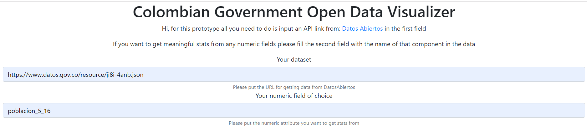

# Colombian Government Open Data Visualizator

This project is delivered before finishing the WebDev class of September 17th of 2019

## Colaborators

- Sergio Guzmán Mayorga:

  [Personal Site](https://sguzmanm.github.io/i-am-sergio-guzman/) - [GitHub](https://github.com/sguzmanm)

## Description

Colombian Government Open Data Visualizator is an app for visualizing data from Datos Abiertos Colombia (https://datos.gov.co/) through navio. You only have to put the link of the API for querying the data and, in a matter of a creative feature, you can type the name of a label with numeric values for getting stats (average,sum.min and max) if you want to.

## Objectives

- Visualize data from Datos Abiertos Colombia
- Get stats from a numeric field

## Links

- Deployment: https://colombiangovopendatavis.firebaseapp.com/

## Tecnologies used

This project was developed using the MERN stack.

- **React JS**: A Front End library useful for creating components. https://reactjs.org/
- **Navio**: A data visualizator. https://navio.dev/

Some extra dependencies were included in the project. Each can be seen in react-front-end folder or in the package.json files in the respective folder.

## Instructions to execute

### Requisites

- **Node JS**

Verify that nodejs is installed by running "node -v" on terminal or cmd. It can be downloaded in https://nodejs.org/ (versión LTS)

### Steps to run development version

1. Check frontend folder for complete instructions on how to execute the frontend

## Screenshots

## License

This project is public under the MIT license, found [here](https://github.com/sguzmanm/ColombianGovOpenDataVis/blob/master/LICENSE)
